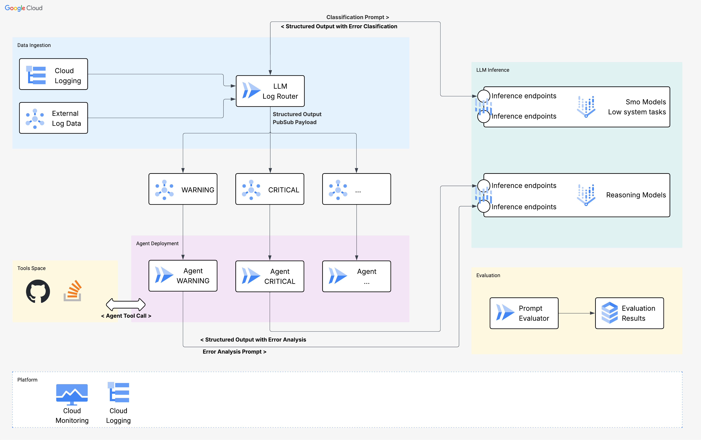

# Error Buddy Agent

Repository holding the implementation of a vertical error agent using the following reference architecture.

## Repository Structure
- `cloudrun-python-image`: Base docker image used throughout
- `error-agent`: Vertical agent addressing each error type and providing support in solving it
- `log-router`: Triage the incoming log messages based on their log level
- `prompt-evaluator`: A base evaluation metrics on how the triage and the error agents are performing
- `python-app`: A sample fastapi application generating several error types. This is **the** application you might have in production which is sending its logs to be analysed